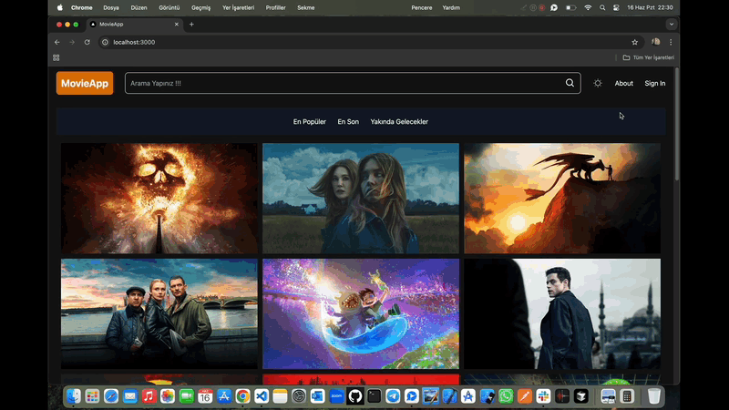

# MovieApp-Nextjs 🎬

<li>Bu proje React ve Next.js ile hazırlanmış film sitesidir.</li>
<li>Kategorilere göre filmler listelenmektedir.</li>
<li>Filmlere ait detay verileri mevcuttur.</li>
<li>Arama özelliği ile film filtrelemesi yapılmıştır.</li>
<li>Dark ve Light modu entegre edilmiştir.</li>
<li>Kullanıcı dostu modern responsive tasarımı vardır.</li>

# Kullanılan Teknolojiler 🎨

<li>⭐ React</li>
<li>⭐ Next.js</li>
<li>⭐ Apı</li>
<li>⭐ Tailwindcss</li>
<li>⭐ React-Theme</li>
<li>⭐ React-İcons</li>

# Ekran Görüntüsü 🎥
    

# İletişim 📩
yunusemreoral@hotmail.com.tr
